# Student Management App - Visual Architecture Diagrams

## System Overview

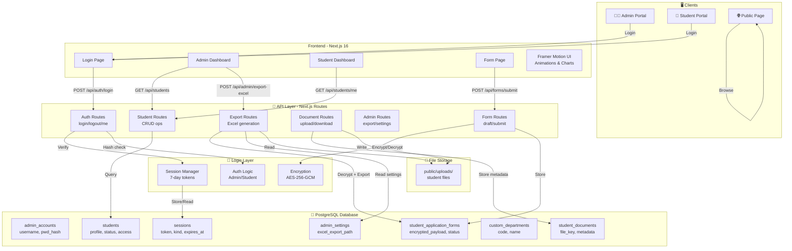

## Database Schema Relationships

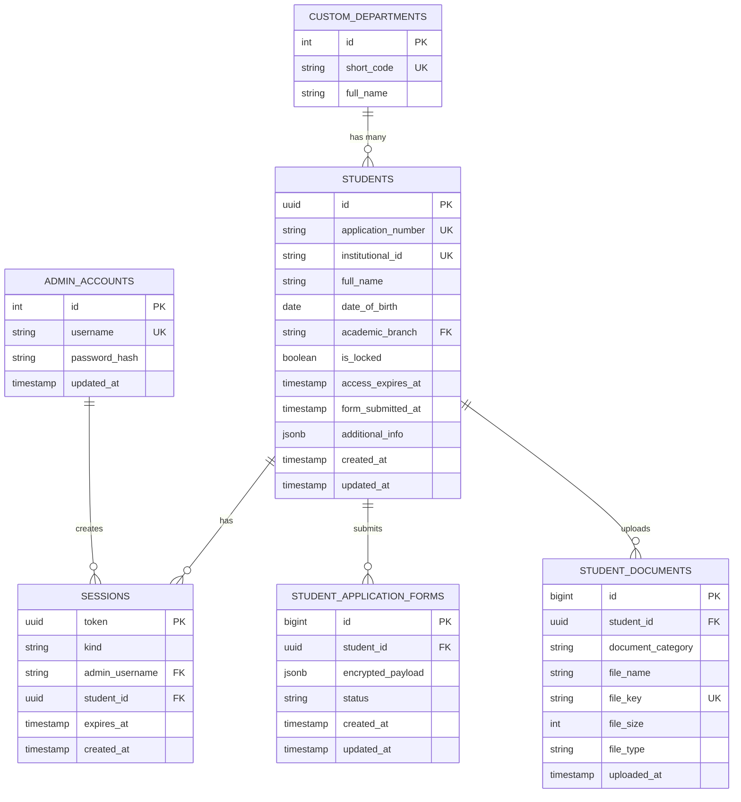

## Student Form Lifecycle

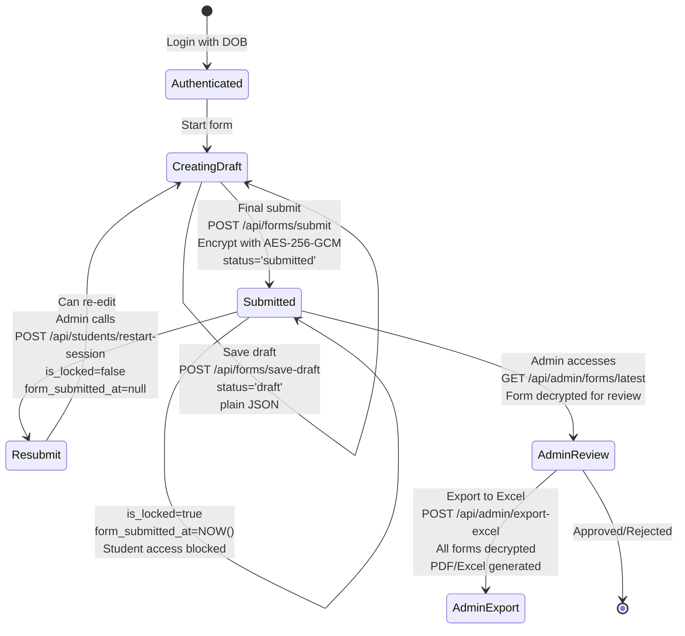

## Access Control Flow

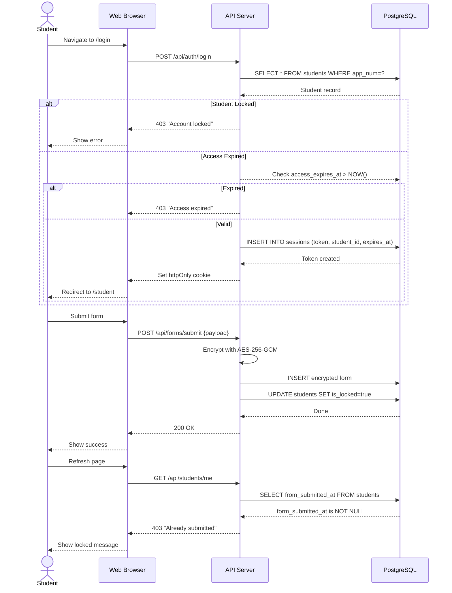

## Form Export Pipeline

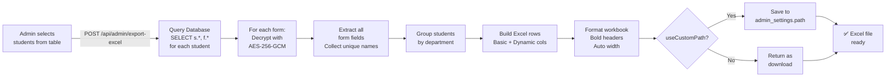

## Encryption Architecture

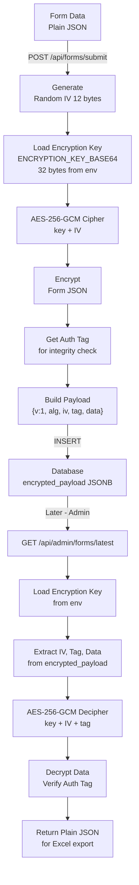

## API Authentication Guard

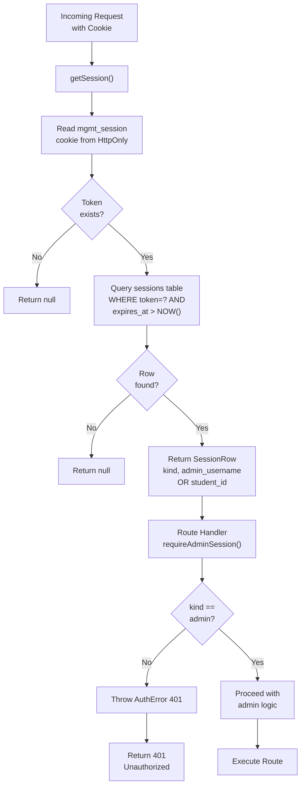

## Data Storage - File Upload Flow

```mermaid
graph LR
    A["Student uploads<br/>Document.pdf<br/>Category: Aadhar"] -->|FormData| B["POST /api/documents"]
    
    B --> C["Generate file_key<br/>{uuid}_{timestamp}_{name}"]
    
    C --> D["Write to disk<br/>public/uploads/{file_key}"]
    
    D --> E["INSERT INTO<br/>student_documents<br/>student_id, category,<br/>file_key, size, type"]
    
    E --> F["Return 200 OK"]
    
    F -->|Later| G["Admin: GET /api/admin/documents<br/>?studentId=APP123"]
    
    G --> H["Query student_documents<br/>WHERE student_id=?"]
    
    H --> I["Return list of files<br/>with metadata"]
    
    I --> J["Admin clicks download"]
    
    J -->|GET /api/documents/download| K["Stream file from<br/>public/uploads/{file_key}"]
    
    K --> L["Browser downloads<br/>original filename"]
    
    L --> M["Admin can also<br/>DELETE document"]
    
    M --> N["Remove file from disk<br/>DELETE from DB"]
```

## Admin Dashboard Data Loading

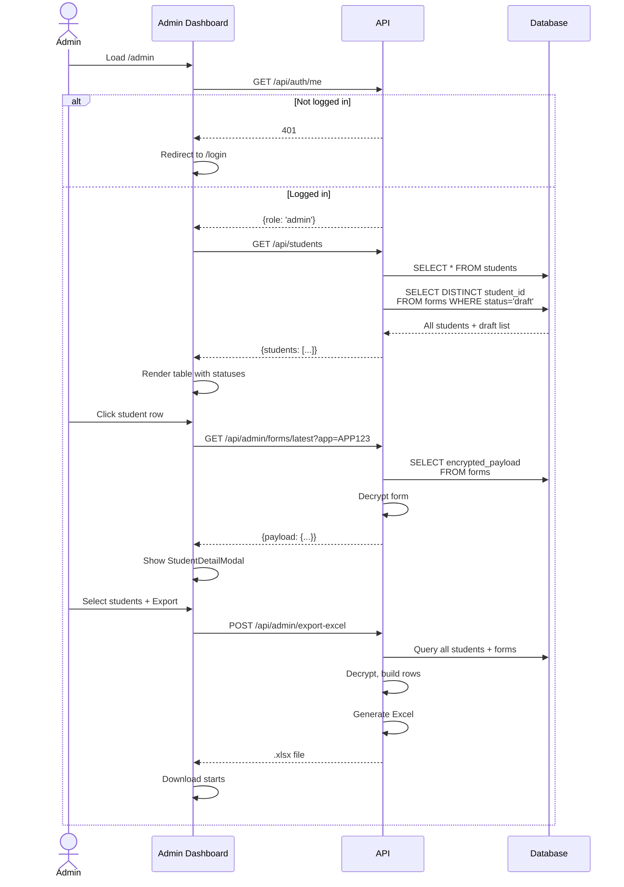

## Technology Stack Diagram

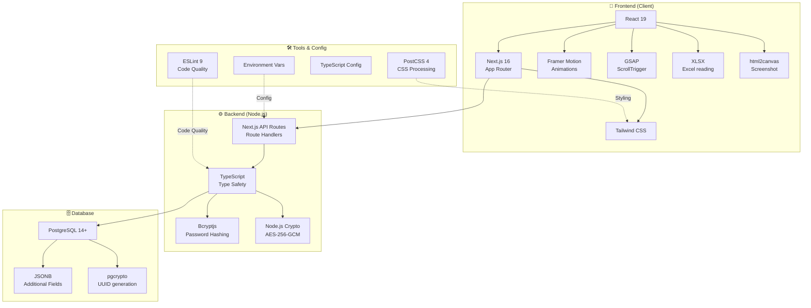

## Security Layers

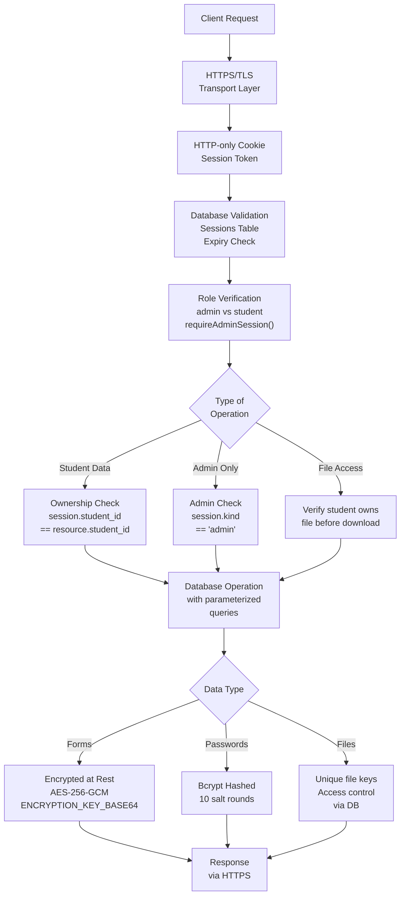

---

These diagrams illustrate:
1. **System Overview** - High-level architecture
2. **Database Schema** - Entity relationships
3. **Form Lifecycle** - State machine for submissions
4. **Access Control** - Session validation flow
5. **Export Pipeline** - Excel generation process
6. **Encryption** - AES-256-GCM flow
7. **Auth Guards** - API protection layers
8. **File Upload** - Document storage process
9. **Dashboard** - Data loading sequence
10. **Tech Stack** - Technology choices
11. **Security** - Multi-layer defense
